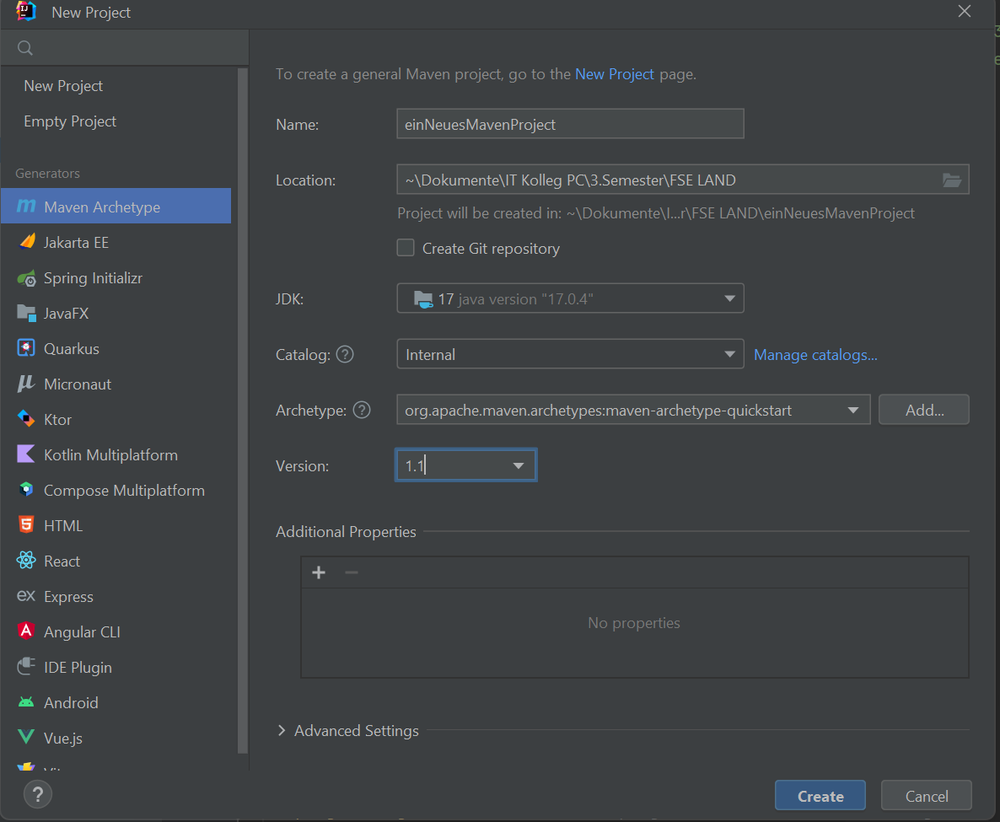
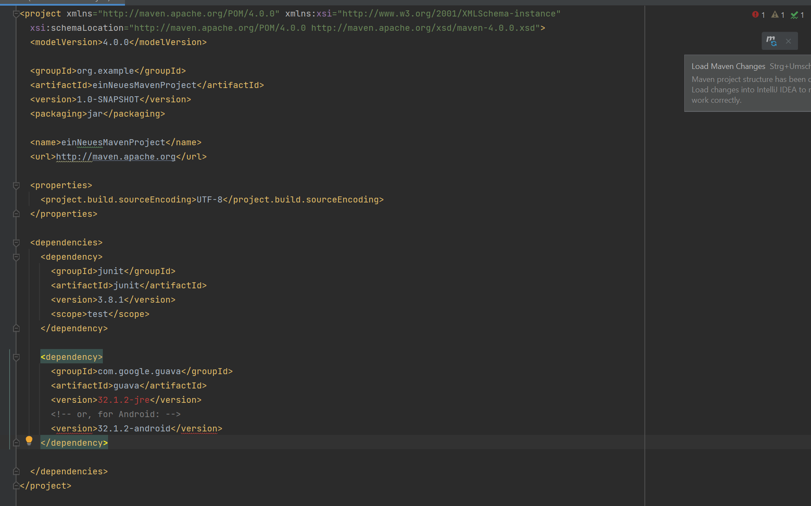
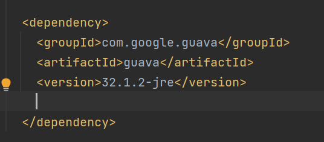
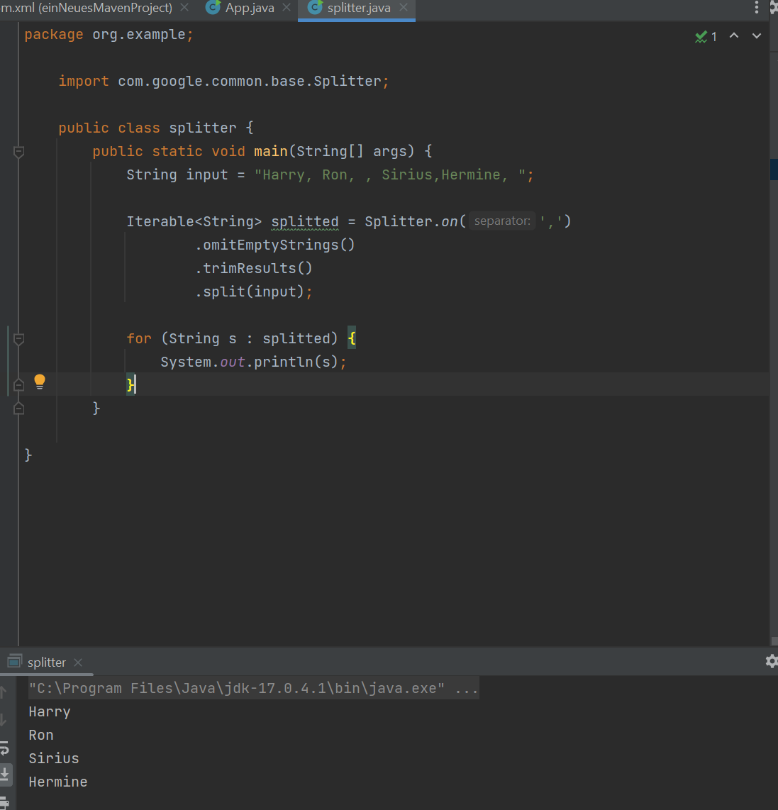

# Build_Tool_maven

Was ist eigentlich Maven ?

Maven ist ein Build- und Projektmanagement-Tool in Java. In die pom.xml Datei können wir Bibliotheken und andere Projekte einbinden. Dort werden diese automatisch heruntergeladen und wird dann für das Projekt bereit gestellt.

# Installation

Um Maven zu installieren lade ich mir die Binary zip archive Datei herunter, entpacke den Zip Ordner. Gehe in den entpackten Ordner hinein und kopiere mir den bin Pfad.

Dann Gehe ich in die Systemumgebungsvariable -> Umgebungsvariable -> Waehle Path Variable -> Bearbeiten -> Neu und fuege dort den Pfad hinein. -> OK

IN CMD gebe ich den Befehl mvn -v ein. Nun sollten einige Daten über die intstallierte Version da stehen.

# Ein neues Projekt erstellen

Um ein neues Projekt zu erstellen, erstelle ich als erstes ein neuen Ordner wo dann mein Maven Projekt sein soll.
Ich kopiere mir den Pfad des Ordners und gehe in CMD in den entsprechenden Pfad mit cd "Pfad"

Wenn ich in dem Pfad bin gebe ich folgenen Befehl ein:

mvn archetype:generate -DgroupId=com.mycompany.app -DartifactId=my-app -DarchetypeArtifactId=maven-archetype-quickstart -DarchetypeVersion=1.4 -DinteractiveMode=false

Dies kann einen kurzen Moment dauern, da Maven einige Daten und Plugins runterlaed.

Nachdem der Download fertig ist gebe ich den Befehl in CMD cd my-app ein.

Nun gebe ich den Befehl mvn package ein.

java -cp target/my-app-1.0-SNAPSHOT.jar com.mycompany.app.App

Wenn alles funktioniert hat, sollte am Schluss "Hello World!" stehen.

# IntelliJ und Maven

Hier erstelle ich in der IDE ein neues Maven Projekt in IntelliJ.



Ich wähle als Test in Archetype: archetype-quickstart

Nun create ich das Projekt.

Wie im Auftrag beschrieben füge ich von Google die Guava-Bibliothek als Dependancy.



Oben rechts erscheint nun ein kleines Fenster mit einem M zum aktulalisieren.

Zuvor lösche ich die Zeile für die Android-Version raus und nun klicke ich auf aktualisieren.



Nach dem Aktualiseren scheint kein Fehler mehr auf.

## Die GUAVA Bibliothek

eine Sammlung von nützlichen Werkzeugen und Erweiterungen für Java-Entwickler.

zb: Collections: Neue Arten von Datenstrukturen und verbesserte Version von Java-Listen, Sets und Maps.

String verarbeitung: um Texte zu teilen, zu verbinden und zu bearbeiten.

Hashing: Werkzeug zum Erstellen einzigartiger Codes aus Daten.

#Hier ein Codebeispiel zur String-Verarbeitung

Splitter: Ein String, der durch Kommas getrennt ist und ich möchte diesen String in eine Liste von Strings aufteilen und dabei die Leerzeichen enfernen und die leeren Einträge ignorieren.


Hier wird der String aufgeteilt und die Beistriche entfernt.

Hier habe ich die Wiki von Guava mir zuhilfe genommen.

https://github.com/google/guava/wiki

# Apache Commons

Sind auch Hilfsfunktionen die nicht im Java Standart enthalten sind.

https://mvnrepository.com/

Auf dieser Seite habe ich mir die "dependency" geholt.

Ich habe mich mit den Commons Lang auseinandergesetzt.

Bietet zusätzliche Funktionen für die Java-Standartklassen, insbesondere für String-Manipulation, Zahlbehandlung...

Hier ist ein Codebeispiel von mir, wie ich eimal einen String überprüfe, ob er leer ist und auch wie ich Strings verändere mit trim und mit capitalized.

```
package org.example;

import org.apache.commons.lang3.StringUtils;

public class test {

    public static void main(String[] args) {

        // Überprüfen, ob ein String leer ist
        boolean isEmpty = StringUtils.isEmpty("Der String ist voll befüllt mit Zeichen");
        System.out.println("Ist der String leer? " + isEmpty);

        // Leerzeichen werden vor und nach dem Test weggeschnitten
        String trimmed = StringUtils.trim("                  Java ist auch eine Insel    ");
        System.out.println("Nach dem Trimmen: " + trimmed);

        // Der erste Buchstabe des Strings wird großgeschrieben
        String capitalized = StringUtils.capitalize("hELLO WORLD");
        System.out.println("Kapitalisiert: " + capitalized);
    }

}


```
